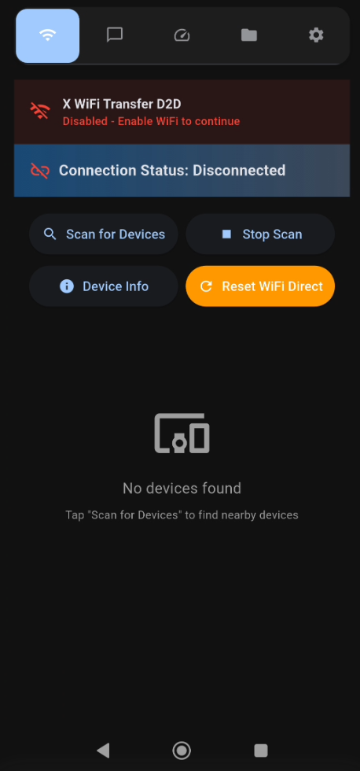
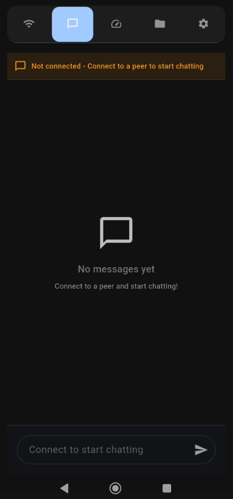
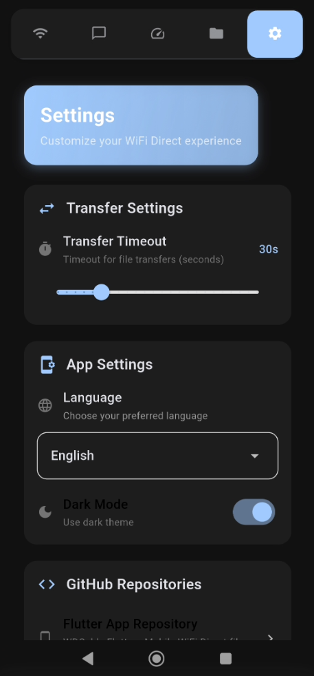
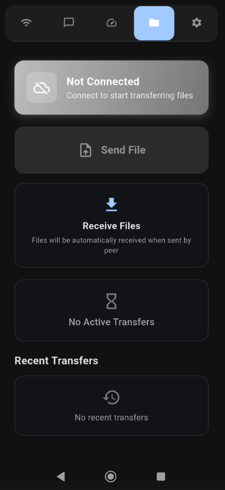

# X-Air-Transfer

**X-Air-Transfer** is a cross-platform Flutter application designed for ultra-fast, offline file and message transfer between devices using Wi-Fi Direct. It establishes a direct peer-to-peer (P2P) connection, eliminating the need for an internet connection or a wireless router. This results in significantly faster and more stable transfers compared to methods like Bluetooth or traditional Wi-Fi hotspots.

## ✨ Features

*   **Direct P2P Connection**: Establishes a direct device-to-device link using Wi-Fi Direct, completely offline.
*   **High-Speed Transfers**: Transfer large files and data at high speeds with progress tracking.
*   **Real-time Chat**: Securely and instantly chat with a connected peer.
*   **Network Speed Test**: Measure the actual download and upload speed of the P2P connection.
*   **Multi-language Support**: Fully localized in English, Arabic, and Chinese.
*   **Customizable Theme**: Switch between light and dark modes.
*   **Cross-Platform**: Built with Flutter for multi-platform support (currently optimized for Android).

## 🎥 Demo
<p align="left">
  
  
  
  
  
</p>


## 🛠️ How It Works

The application is built with the Flutter framework and uses a `MethodChannel` (`wifi_direct_cable`) to interface with the underlying native platform's Wi-Fi Direct APIs. The core logic is managed by the `WiFiDirectController`, which handles state management based on an event-driven architecture powered by the `WiFiDirectService`.

The UI is organized into five main tabs:
*   **Connection**: Scan for nearby devices, manage connections, and view system logs.
*   **Chat**: Send and receive text messages in real-time.
*   **Speed Test**: Run download and upload speed tests to benchmark the connection.
*   **File Transfer**: Send files and monitor active and recent transfers.
*   **Settings**: Configure application settings, including theme and language.

## 🚀 Getting Started

To get a local copy up and running, follow these simple steps.

### Prerequisites

You need to have the Flutter SDK installed on your system.
*   [Flutter Installation Guide](https://docs.flutter.dev/get-started/install)

### Installation & Running

1.  Clone the repository:
    ```sh
    git clone https://github.com/AhmedAljamal15/X-Air-Transfer.git
    ```
2.  Navigate to the project directory:
    ```sh
    cd X-Air-Transfer
    ```
3.  Install the dependencies:
    ```sh
    flutter pub get
    ```
4.  Run the application:
    ```sh
    flutter run
    ```

## 📂 Project Structure

```
lib/
├── Presentation/Views/    # Main UI screens and views
│   └── wifi_direct_home_page.dart
├── controllers/           # State management and business logic
│   └── wifi_direct_controller.dart
├── l10n/                    # Localization and internationalization files
├── models/                  # Data models (Device, Connection, Message, etc.)
│   └── wifi_direct_models.dart
├── providers/             # UI-related state providers (Theme, Language)
├── services/              # Low-level services (data management)
├── theme/                   # Theme provider and definitions
├── widgets/                 # Reusable UI components for each tab
├── main.dart                # Application entry point
└── wifi_direct_service.dart # Handles native communication via MethodChannel
```

## 🤝 Contributing

Contributions are welcome! Feel free to open an **Issue** or submit a **Pull Request** for any improvements or new features.

## 📄 License

This project is open-source under the MIT License.
